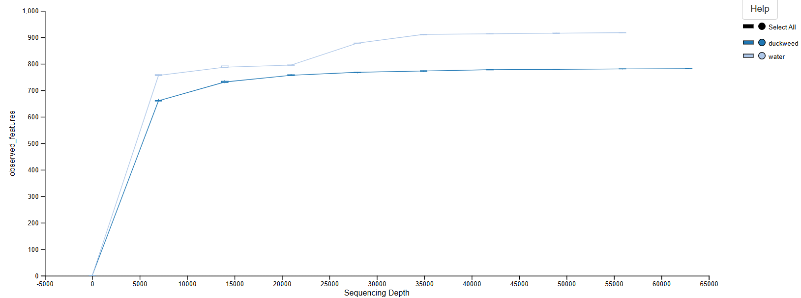

# Final Project: Qiime2 Microbiome Analysis

## Group Members
Molly Dugan,
Alexandria Lyden, 
Phaedra Stemp 

<details> <summary><H1> Background </H1></summary>
The data for this analysis was provided by a UNH grad student studying duckweed microbiome composition. It consisted of 16s data in paired-end 250 bp reads that were amplified by Illumina HiSeq 2500. The files were made up of 20 samples from two different pond locations. Sample treatments were either taken directly from the duckweed on the pond, or from the pond water itself. There were 5 replicates taken from each of the sample treatments. With this data, we wanted to analyze the microbiome composition differences between samples. The goal was to compare and contrast the microbiomes between the replicates with the same treatment, as well as between the two different treatments.

</details></details>

<details> <summary><H1> Methods </H1></summary>
The data used in this project was provided by a grad student studying duckweed. It consisted of 250 bp paired-end reads, sequenced using Illumina HiSeq 2500. All analysis done on this data was done on RON through the University of New Hampshire. All use of RON was performed on the personal laptops of each group member. Multiple tools within RON were used to create a pipeline, and perform the following analyses.

### Source Activate qiime2-amplicon-2024.5
This command activated the qiime2 environment. This provided access to all the tools used in the following steps of the pipeline.

### Import
This tool imported our data files into the environment. It produced a metadata demux file. The output was a qza data file that stored the project data.

### Demux Summarize
This tool demultiplexed the project data. It assessed the quality of the data sequences and provided a summary visualization. The output was a histogram file and quality score graph qzv file that were used to determine where to trim the reads. The files were visualized using the Qiime2 View program available online.

### DADA2 Denoise-Paired
This tool processed the paired-end reads. It trimmed the reads where we indicated based on the visualizations from the Demux Summarize command and made three metadata qza files. The output was three metadata files, one storing the denoising statistics, one other storing the amplicon sequence variant sequences that were trimmed, and one organizing the amplicon sequence variants to put into a table when visualized.

### Metadata Tabulate
This tool took the stats metadata file from the DADA2 Denoise-Paired command and created a visualization file to make the data visible in a table. The output was a qzv file that visualized the trimmed metadata in a table. The file was visualized using the Qiime2 View program.

### Feature-Table Summarize-Plus
This tool took the amplicon sequence variants and the whole metadata and created two qza metadata files and one qzv visual file. These contained data the showed how many sequences were associated with each sample and feature, as well as some summary statistics. The visualization file provided histograms of the distributions. The visualization was done using the Qiime2 View program.

### Feature-Table Tabulate-Seqs
This tool took the amplicon sequence variants and their frequencies and created a mapping of their feature IDs to the sequences. This merged the two qza metadata files and created a qzv visualization file, which was visualized using Qiime2 View.

### Feature-Table Filter-Features
This tool filtered the feature table of amplicon sequence variants. It analyzed the data to include only those with a specified number of samples, and created a qza metadata file containing them. The output was a metadata file containing only the samples with the specified number.

### Feature-Table Filter-Seqs
This tool took the filtered table with the specified samples and used it to filter all the sequences to only those specified in the table. The output was a qza metadata file containing only the sequences that fit the criteria outlined by the filtered feature table.

### Feature-Table Summarize-Plus
This tool took the feature table file and the overall metadata and created a summary table qzv file and two qza metadata files. The metadata files contained the sample and amplicon sequence variants frequencies. The output table was a summary of the comparison of the two files, and was visualized with Qiime2 View.

### wget -O 'suboptimal-16S-rRNA-classifier.qza'
This tool was used to download a 16s rRNA classifier. The command downloaded a metadata classifier file using a URL.

### Feature-Classifier Classify-Sklearn
This tool was used to classify the amplicon sequence variants sequences. It used the previously downloaded classifier to analyze the sequences and create a classification file. The output was a qza metadata file that stored the taxonomy of the of the sequences.

### Conda Env Create
This tool was used to download the Boots tool form the internet, using a URL. The outcome was that the Boots tool was now available in its own environment for use in the pipeline.

### Source Activate q2-boots-amplicon-2025.4
This command activated the Boots environment that was previously downloaded. It allowed all the tools within the environment to be accessed for the following steps in the pipeline.

### Boots Kmer-Diversity
This tool was used to bootstrap and provide rarefication-based alpha and beta diversity analyses. It took the amplicon sequence variant sequences and metadata and created diversity metrics for the specified samples and sample depth, along with confidence intervals for these metrics. The output was a qzv scatterplot in a new directory that showed the diversity of the samples.

### Tree Stuff

### Diversity Alpha-Rarefication
This tool took the sorted amplicon sequence variants and investigated the diversity in relation to the specified maximum sequence depth. It took the sorted amplicon sequence variants and metadata and created a qzv visual plot, showing different diversity metrics at multiple sampling depths. The output was a qzv graph showing the diversity metrics, which was visualized using Qiime2 View.

### Taxa Barplot
This tool took the amplicon sequence variants and created a bar plot of the taxonomy in them. It used the amplicon sequence variants, the total metadata, and the taxonomy metadata file to create a bar plot showing the species present in the samples. The output was a taxonomy bar plot qzv visualization file that was visualized using Qiime2 View.

### Feature-Table Filter-Samples
This tool took the amplicon sequence variants and sorted them by the different sampling types from the original data collected. It sorted the variants into a table that categorized them by the sample types. The output of this was a qza metadata table that had the sorted samples in their groups.

### Taxa Collapse
This tool took the amplicon sequence variants and sorted them into the genera groups. It took the filtered sample types file and the taxonomy file and created a table with the groups collapsed into the genera. The output was a qza metadata table containing the sorted genera groups from the sample.

### Composition ANCOM-BC
This tool applied differential abundance testing to the genera of the samples. It took the genera data and used one of the sample types as a reference to compare the abundance of the other sample to. The output was a qza metadata file that held the abundance amounts of the different sample types.

### Composition DA-Barplot
This tool took the abundance metadata file and created a visualization. It used a delimiter to sort each sample abundance and create a bar plot of abundance. The output was a qzv file that showed the relative abundance of genera in one sample compared to the other. It was visualized using Qiime2 View.

</details></details>

<details> <summary><H1> Results </H1></summary>

With the analysis above, the following can be performed:

<details> <summary><H3> Demultiplexed Sequence Counts Summary </H3></summary>

)

Explain

</details>

<details> <summary><H3> Taxonomy Summary </H3></summary>


Explain

</details>

<details> <summary><H3> Phylogenetic Tree </H3></summary>


Explain

</details>

<details> <summary><H3> Alpha Rarefaction </H3></summary>



Explain

</details>

<details> <summary><H3> kmer Diversity Summary </H3></summary>

</details>

<details> <summary><H3> Abundant Genera </H3></summary>

</details>

</details></details>

<details> <summary><H1> Code </H1></summary>
  
```bash
```

</details></details>

<details> <summary><H1> Bibliography </H1></summary>

</details></details>
